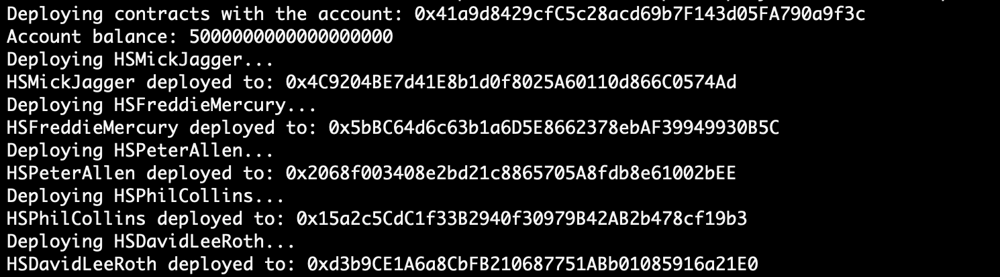

# Hannes Schmid NFT Collection README

There are 5 contracts à 150 NFTS.

1. Install Hardhat:

https://hardhat.org/hardhat-runner/docs/getting-started#installation

2. Compile contracts

    ```npx hardhat compile```

3. Define which network to use and specify private key

    Go to 'hardhat.config.ts' and specify your private key and your alchemy key. If you want to use another network, add it under "networks" there.

3. Deploy contracts

     ```npx hardhat run scripts/deploy.ts --NETWORK_TO_USE``` e.g ```npx hardhat run scripts/deploy.ts --polygon_mumbai```

    This will deploy all 5 contracts on the network. You should see 5 contract addresses in your console.

    

4. Add contract addresses

    Take your 5 contract addresses and add the corresponding address in the file 'scripts/mint.js'.
    You can either mint all 5 contracts in a single command or do it one by one. I recommend to do it one contract by one in case there are network errors etc. Also it takes quite a long time to finish. Start with block 1 and comment out the other 4. After you minted the first one comment out the first and uncomment the second etc.

5. Mint

    ```npx hardhat run scripts/mint.js --NETWORK_TO_USE```

    Do this 5 times after each uncommenting code blocks and comment the ones already used.
    
    Every contract will mint 150 NFTS each going to the 150 addresses in 'PublicAddressHannesSchmid.json'. Every address will receive 5 NFTS.


